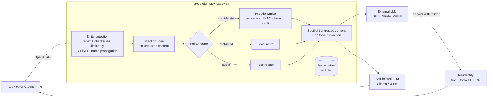

# Sovereign LLM Gateway

**A drop-in, OpenAI-compatible gateway that lets organisations use external LLMs on sensitive data without the sensitive data leaving their perimeter.**

Banks, insurers and public administrations want the quality of frontier models (GPT, Claude) for their RAG assistants and agents, but their documents contain client names, IBANs, social security numbers and confidential deal names. This gateway sits between any application and the model providers and enforces a data policy on every request:

- **Pseudonymise** names, organisations, addresses and identifiers with consistent, typed tokens before the prompt leaves, and restore them in the answer (including inside tool-call arguments).
- **Route** by sensitivity: restricted data is only ever processed by a self-hosted model.
- **Contain** indirect prompt injection from retrieved documents and tool outputs (spotlighting, tool stripping, blocking).
- **Prove it**: every decision goes to a tamper-evident audit log, and leak rates are measured against a multilingual benchmark.

Applications only change their `base_url`. No change to the RAG pipeline, the agent framework or the prompts.

## Results

How much personal data would still reach the provider? Benchmark on 30 hand-written Swiss business documents and 600 synthetic ones, in English, French and German ([full results](docs/BENCHMARK.md)):

| detector chain | residual leak (gold) | residual leak (synthetic) | precision (gold / synthetic) |
|---|---|---|---|
| regex only (v0.1) | 83.5% | 82.3% | 100% / 100% |
| Presidio, default English config | 33.8% | 33.0% | 59% / 69% |
| Presidio, EN+FR+DE models | 17.9% | 21.2% | 54% / 62% |
| **this gateway** (regex + GLiNER + name propagation) | **2.1%** | **1.7%** | **96% / 97%** |

*Residual leak* counts an entity as leaked unless **every** character of it is masked: masking "Meier" but not "Anna" in "Anna Meier" is a leak. *Precision* is the share of masked spans that are real personal data; Presidio's low precision means it also masks cities, ordinary dates and words like "Caller", which degrades answers.

Why the difference: Presidio has no recogniser for AHV numbers and its default phone recogniser misses most `+41` formats and its spaCy models miss, for example, lower-case names in chat transcripts. GLiNER's multilingual model needs no language detection, and *name propagation* masks later mentions ("Mr Krasniqi", "Arben") once a full name is found anywhere in the request. The ablation without propagation leaks 6.2% on both sets.

**Read these numbers with care.** Both datasets were written alongside the system (propagation was added after error analysis on the gold set), the gold set is small (145 entities), and Presidio runs with small spaCy models and no custom recognisers. Detection costs about 200 ms per document on 2 CPU cores. An external dataset and end-to-end comparisons with LLM Guard and LiteLLM are on the [roadmap](docs/ROADMAP.md).

## Architecture



| Sensitivity | Example entities | Default action |
|---|---|---|
| `public` | locations | passthrough |
| `confidential` | person, organisation, address, e-mail, phone, date of birth, client names | pseudonymise, then external model |
| `restricted` | AHV/AVS number, IBAN, card number | local model only |

Prompt injection is handled separately from routing: sending a poisoned document to another model does not neutralise it. Untrusted content (tool messages, and `<document>`/`<context>` segments in user messages) is always wrapped in boundaries that are random per request, so an attacker cannot forge the closing marker. When the scan flags it, the request loses its tools (`strip_tools`, default) or is refused (`block`).

Everything is driven by [`config/policy.yaml`](config/policy.yaml).

## What a request looks like

```text
User sends     : Draft a reply to anna.meier@example.ch about the Muster Holding AG renewal.
Provider sees  : Draft a reply to <EMAIL_c2322d> about the <CLIENT_ccff2f> renewal.
Provider says  : Subject: <CLIENT_ccff2f> renewal ... I will send the details to <EMAIL_c2322d>.
User receives  : Subject: Muster Holding AG renewal ... I will send the details to anna.meier@example.ch.
```

The dry-run endpoint shows exactly what would leave the perimeter, without calling any model:

```bash
curl -s localhost:8080/v1/inspect -H 'Content-Type: application/json' \
  -d '{"messages":[{"role":"user","content":"Mail anna.meier@example.ch"}]}' | jq
```

## Quickstart

```bash
cp .env.example .env              # set SOVGATE_HMAC_SECRET and EXTERNAL_API_KEY
make install && make test && make eval
make run                          # or: make up  (gateway + Ollama with Docker Compose)

# free-text entities (names, organisations, addresses)
make install-ner                  # GLiNER + Presidio + spaCy models
# then set `ner.backend: gliner` in config/policy.yaml
make benchmark                    # reproduce the results table
```

Any OpenAI client then works unchanged:

```python
from openai import OpenAI
client = OpenAI(base_url="http://localhost:8080/v1", api_key="unused")
client.chat.completions.create(
    model="any",
    messages=[{"role": "user", "content": "..."}],
    extra_headers={"X-Tenant-Id": "bank-a", "X-Session-Id": "case-42"},
)
```

## Design decisions

- **Keyed HMAC tokens, scoped per tenant.** The same value maps to the same token within a tenant, so the model can reason about who did what across chunks and turns, but the provider cannot link a person across organisations. `session` scope removes linkage across conversations too.
- **Typed tokens, not `[REDACTED]`.** `<PERSON_3f9a1c>` keeps the semantic role; blanket redaction destroys answer quality.
- **Fail closed.** If a detector crashes, the request is refused (503) and audited. `fail_mode: open` exists, is explicit and is audited too.
- **Checksum validation** (EAN-13 for AHV, mod-97 for IBAN, Luhn for cards) keeps false positives low on numeric data.
- **Name propagation across messages.** A name detected in the user's question is also masked in the retrieved chunks and tool outputs of the same request.
- **Tool calls are data too.** Arguments are pseudonymised on the way out and re-identified inside the JSON on the way back, without breaking it.
- **Tolerant re-identification.** Models sometimes rewrite tokens (`person 3F9A1C`); a second pass restores them. Token collisions are resolved by lengthening the token.
- **Pure, framework-independent pipeline** (`pipeline.Gateway`): every security property is unit-tested, and the benchmark drives the same code as production.
- **The audit log never stores raw values**, only counts, decisions and metrics, and is hash-chained (`python -m sovgate.audit verify`).

## Threat model (summary)

| Threat | Mitigation | Status |
|---|---|---|
| Sensitive data sent to a third-party provider | pseudonymisation, sensitivity routing, NER + propagation | v0.2, measured |
| Provider linking a person across customers | per-tenant / per-session HMAC keys | v0.2 |
| Detector failure silently leaking data | fail-closed by default, audited | v0.2 |
| Indirect prompt injection via documents and tool outputs | spotlighting, scan, tool stripping / block | v0.2 baseline, classifier planned |
| Agent tool calls leaking data | arguments pseudonymised and restored | v0.2; MCP allowlist planned |
| Tampering with the audit trail | hash chain verification | v0.1 |
| Vault compromise | encrypted, TTL-bound storage | in-memory today, Redis + KMS planned |
| Quasi-identifiers ("the CFO of the Lugano branch") | not solved by NER | documented limitation |
| Client-supplied tenant header | must come from authenticated API keys in production | documented, planned |

## Regulatory context

The gateway is a technical control that supports, but does not by itself guarantee, compliance with the Swiss nFADP, the GDPR (pseudonymised data remains personal data, Art. 4(5)), FINMA outsourcing expectations, and the record-keeping and transparency duties of the EU AI Act.

## Project layout

```
src/sovgate/
  app.py            OpenAI-compatible API (chat completions, inspect, health)
  pipeline.py       request preparation and response restoration (framework-independent)
  router.py         sensitivity-based routing decision
  audit.py          hash-chained audit log + verifier
  pii/              regex, dictionary and NER detectors, propagation, pseudonymiser, vault
  guards/           prompt-injection scan, spotlighting
config/policy.yaml  data policy
evals/
  data/             gold (hand-written) and synthetic datasets + generator
  benchmark.py      detector benchmark (leak, precision, latency)
  leak_eval.py      fast structured-identifier gate used in CI
tests/              unit, pipeline and API tests (mocked upstream)
```

## License

MIT. The default NER model, [`urchade/gliner_multi_pii-v1`](https://huggingface.co/urchade/gliner_multi_pii-v1), is published under Apache-2.0.
