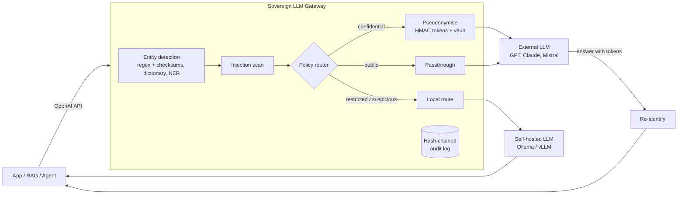

# Sovereign LLM Gateway

**A drop-in, OpenAI-compatible gateway that lets organisations use external LLMs on sensitive data without the sensitive data leaving their perimeter.**

Banks, insurers and public administrations want the quality of frontier models (GPT, Claude) for their RAG assistants and agents, but their documents contain client names, IBANs, social security numbers and confidential deal names. This gateway sits between any application and the model providers and enforces a data policy on every request:

- **Pseudonymise** confidential entities with consistent, typed tokens before the prompt leaves, and restore them in the answer.
- **Route** by sensitivity: restricted data is only ever processed by a self-hosted model.
- **Defend** against prompt injection hidden in retrieved documents.
- **Prove it**: every decision is written to a tamper-evident audit log, and leak rates are measured in CI.

Applications only change their `base_url`. No change to the RAG pipeline, the agent framework or the prompts.

## Architecture



| Sensitivity | Example entities | Default action |
|---|---|---|
| `public` | locations | passthrough |
| `confidential` | person, e-mail, phone, client names | pseudonymise, then external model |
| `restricted` | AHV/AVS number, IBAN, card number | local model only |
| suspected injection | instructions hidden in a document | local model only (configurable: `block`) |

Everything is driven by [`config/policy.yaml`](config/policy.yaml).

## What a request looks like

```text
User sends     : Draft a reply to anna.meier@example.ch about the Muster Holding AG renewal.
Provider sees  : Draft a reply to <EMAIL_c2322d> about the <CLIENT_ccff2f> renewal.
Provider says  : Subject: <CLIENT_ccff2f> renewal ... I will send the details to <EMAIL_c2322d>.
User receives  : Subject: Muster Holding AG renewal ... I will send the details to anna.meier@example.ch.
```

Use the dry-run endpoint to see exactly what would leave the perimeter:

```bash
curl -s localhost:8080/v1/inspect -H 'Content-Type: application/json' \
  -d '{"messages":[{"role":"user","content":"Mail anna.meier@example.ch"}]}' | jq
```

## Quickstart

```bash
cp .env.example .env              # set SOVGATE_HMAC_SECRET and EXTERNAL_API_KEY
make install && make test && make eval
make run                          # or: make up  (gateway + Ollama with Docker Compose)
```

Any OpenAI client then works unchanged:

```python
from openai import OpenAI
client = OpenAI(base_url="http://localhost:8080/v1", api_key="unused")
client.chat.completions.create(model="any", messages=[{"role": "user", "content": "..."}],
                               extra_headers={"X-Session-Id": "case-42"})
```

## Evaluation

Claims about privacy are worthless without measurements. `make eval` runs the leak evaluation on a deterministic, multilingual (EN/FR/DE) synthetic corpus with valid Swiss identifiers, and CI fails if any entity type leaks.

| entity | samples | leaked |
|---|---|---|
| AHV_NUMBER | 139 | 0 |
| CREDIT_CARD | 108 | 0 |
| EMAIL | 205 | 0 |
| IBAN | 97 | 0 |
| PHONE_CH | 95 | 0 |

Round-trip (pseudonymise then re-identify) is exact on 100% of samples.

**Honest scope:** structured identifiers with checksums are the easy part. The hard part is free-text entities (names, organisations) and the utility cost of pseudonymisation on RAG answer quality. Both are the next milestones in the [roadmap](docs/ROADMAP.md), with their own metrics.

## Design decisions

- **Keyed HMAC tokens, not random IDs.** The same value maps to the same token across chunks and turns, so the model can still reason about who did what. Tokens are useless without the key.
- **Typed tokens, not `[REDACTED]`.** `<PERSON_3f9a1c>` keeps the semantic role; blanket redaction destroys answer quality.
- **Checksum validation** (EAN-13 for AHV, mod-97 for IBAN, Luhn for cards) keeps false positives low on numeric data.
- **Tolerant re-identification.** Models sometimes rewrite tokens (`person 3F9A1C`); a second, fuzzy pass restores them.
- **Routing is a pure function** of entities, injection verdict and policy: easy to test, easy to audit, and an injection signal can only make the decision stricter.
- **The audit log never stores raw values**, only counts, decisions and metrics, and is hash-chained (`python -m sovgate.audit verify`).

## Threat model (summary)

| Threat | Mitigation | Status |
|---|---|---|
| Sensitive data sent to a third-party provider | pseudonymisation, sensitivity routing | v0.1 |
| Indirect prompt injection via retrieved documents | injection scan, stricter routing | v0.1 baseline, classifier planned |
| Re-identification by the provider | keyed tokens, vault never leaves gateway | v0.1 |
| Tampering with the audit trail | hash chain verification | v0.1 |
| Vault compromise | encrypted, TTL-bound storage | in-memory today, Redis + KMS planned |
| Quasi-identifiers ("the CFO of the Lugano branch") | not solved by NER | documented limitation |
| Agent tool calls leaking data | MCP tool-call guard | planned |

## Regulatory context

The gateway is a technical control that supports, but does not by itself guarantee, compliance with the Swiss nFADP, the GDPR (pseudonymised data remains personal data, Art. 4(5)), FINMA outsourcing expectations, and the record-keeping and transparency duties of the EU AI Act.

## Project layout

```
src/sovgate/
  app.py            OpenAI-compatible API (chat completions, inspect, health)
  router.py         sensitivity-based routing decision
  audit.py          hash-chained audit log + verifier
  pii/              detectors, pseudonymiser, vault
  guards/           prompt-injection detection
config/policy.yaml  data policy
evals/              synthetic data and leak evaluation (CI gate)
tests/              unit and API tests (mocked upstream)
```

## Roadmap

See [docs/ROADMAP.md](docs/ROADMAP.md): multilingual NER, RAG utility benchmark, MCP tool-call guard, injection classifier, streaming, observability, Helm chart and a hosted demo.

## License

MIT
